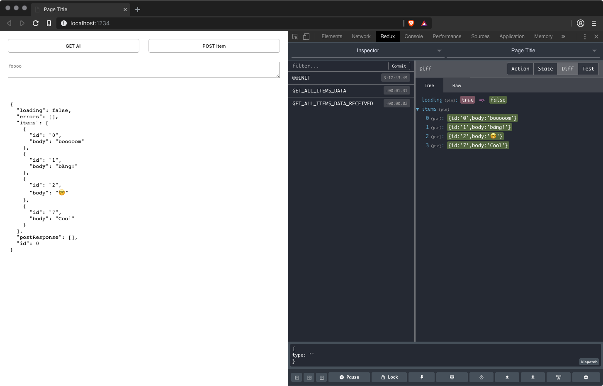

# Redux & Rest

  

This is an example on how to create your own middleware for Redux that allows you to make async requests to a REST API. It is based on [this article](https://www.sohamkamani.com/blog/2016/06/05/redux-apis/) "A simplified approach to calling APIs with redux" by Soham Kamani. The original article was meant for usage with the React library. For a project here \[AT\] IXDS we stripped out the React part and made it a Vanilla-JS project. Follow the article and the code comments to understand the project.  

The important files for you are `client/lib/middleware.js` and `client/lib/requests.js` these hold the main functionality that defines the middleware to make async XMLHttpRequest.

## Structure 

The repository is split into two parts. The folder `client` which holds the client side code with [Redux](https://redux.js.org/) as the only dependency. And the `server` folder which provides a simple REST API written with [Express.js](https://expressjs.com/) and some additional packages.  

On the client side we are using the [parcel-bundler](https://parceljs.org/) package to bundle or frontend and on the server side we are using Typescript and [nodemon](https://nodemon.io/) for development. If you don't want to use Typescript no problem. Just edit the files on `server/lib` instead of `server/src`.  

## Prerequisites

- [Node.js](https://nodejs.org)  

We recommend using a package manager like [Homebrew](https://brew.sh), [Chocolatey](https://chocolatey.org/) or one of the many managers for your linux distro.


## First Run  

To give you a first impression we prepared some scripts in the root `package.json` of this repo. Just run the following commands to set this up and start the client and the server (this is without Typescript support).  

```shell
npm install
npm run bootstrap
npm start
```

Point your browser at [http://localhost:1234](http://localhost:1234) and open the developer console. You can also open another browser window at [http://localhost:3000](http://localhost:3000) to see if your REST API is running and get all entries of the local filesystem store under [http://localhost:3000/get-all](http://localhost:3000/get-all) (Keep in mind if you are running on a fresh install this might be empty).  

The available routes for the API are:  

| Type |           URL            |                              Comment                               |
| :--- | :----------------------- | :----------------------------------------------------------------- |
| GET  | `localhost:3000`         | returns a status                                                   |
| GET  | `localhost:3000/get-all` | returns all items                                                  |
| GET  | `localhost:3000/get/:id` | Id must exist                                                      |
| POST | `localhost:3000/add`     | With a body schema like this `{}` (you can define an `id: String`) |


## Deep Dive

If you want to dive deeper and play with the project we suggest running two separate shells in the folders `client` and `server`. On the client `npm start` runs the parcel development server in port 1234.
On the server you have some more options.

For writing Typescript with nodemon run and edit the files in `src/` (Note that the npm-script used is only tested on MacOS. It uses a `|` for running nodemon and tsc in parallel. Might create problems in Windows):  

```
npm run dev
```

For writing Javascript with nodemon run and edit the files in `lib/` **(Note that running the Typescript compiler later on will overwrite your `.js` files in `lib`)**:  

```
npm start
```
